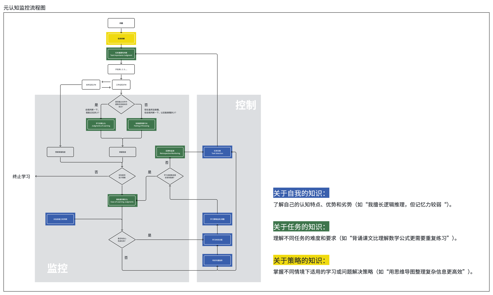

# MetaCogPilot · 元认知副驾 🧠

[English](README.md) | **中文**

> 学习的方法已经够多了——这个 Skill 不给你加新方法。
> 它是你的**陪练**：陪你把「选什么任务、学会了没有、卡住了怎么办」这套元认知监控从大脑里搬出来，做成你的**外置大脑**。

## 为什么需要它

学习体系越繁杂，缺的越不是方法，是监控：

- 工作记忆装不下一个陌生领域，任务一多就失焦——查着查着忘了自己本来要学什么
- 刚学完就觉得自己会了——这是熟练度错觉，不是掌握
- 遇到难的任务，死磕和放弃全凭惯性，事后说不清自己选了哪条路

Nelson & Narens (1990) 的元认知监控模型早就给出了答案：学习是一个需要监控的系统。但元认知本身也占工作记忆——所以这套 Skill 把监控**外置**：让流程替你盯，你只负责学。

## 工作原理

**认知地图 = 外置上下文**

从你已经知道的概念切入，按上级 / 下级 / 并列 / 相关四种关系铺开一张地图。学到哪、卡在哪个概念，都挂在地图上看。挂不上的概念留空位，不硬啃；每个概念学多深，按它与目标的相关性决定。

**监控循环 = 外脑**



```
选任务 → 评估掌握 → 判断难易 → 定策略 → 回溯监测 → 记录
```

- **选任务**：选最重要的，不是最简单的——多数简单任务离目标太远
- **评估掌握**：三层探测——表层（能回忆）/ 语义（能解释）/ 直觉（能应用）
- **判断难易**：看学习材料的可得性；难且没把握就切换任务，任务的关键特征（人名、术语、公式）常是突破口
- **定策略**：分配时间预算，选加工深度——浅加工（只取前提结论）或深加工（语义 + 直觉）
- **回溯监测**：卡住时检查关键特征触发新任务；信心足却失败时先查时间分配

**达标 ≠ 归档**

任务掌握度首次 ≥ 0.8 只标「待复测」，下次会话复测过关才归档。依据是延迟学习判断效应（Nelson & Dunlosky, 1991）：刚学完的自评来自短时记忆流畅感，系统性偏高，延迟复测才是真实掌握度。

**苏格拉底追问**

零基础学习者自动启用。按澄清 → 假设 → 证据 → 视角 → 后果 → 反思六个维度追问，每个目标最多 3 轮，随时可以说"直接解释"退出。教练是支架，不是搜索引擎：默认动作是搭图和追问，直接倾倒答案是例外。

## 功能特性

- ✅ 元认知监控循环（六步外脑流程）
- ✅ 认知地图（四种概念关系，Mermaid 思维导图）
- ✅ 三层掌握度评估 + 延迟复测校准
- ✅ 卡住时四条路：死磕 / 切换 / 外援 / 搁置
- ✅ 苏格拉底式追问（零基础自动启用）
- ✅ 断点续学、多目标管理、认知循环记录
- ✅ Obsidian 知识库同步（可选）

## 安装与使用

### 命令行模式

```bash
# 进入项目目录后直接运行（无需安装依赖，纯 Python 标准库）
python scripts/coach.py start 机器学习          # 开始新主题
python scripts/coach.py start 机器学习 --level 零基础   # 零基础，自动启用苏格拉底模式
python scripts/coach.py status                  # 查看进度
python scripts/coach.py list                    # 列出所有学习目标
python scripts/coach.py mindmap                 # 生成思维导图
python scripts/coach.py export                  # 导出数据
python scripts/coach.py socratic 监督学习        # 苏格拉底式评估
python scripts/coach.py answer "你的回答"
python scripts/coach.py explain                 # 退出追问，获取直接讲解
```

### 交互模式

```bash
python scripts/coach.py

教练> start 机器学习
教练> continue
教练> status
教练> report
教练> mindmap
```

## 作为 AI Skill 使用

MetaCogPilot 是一个标准 Skill（SKILL.md + scripts + data），装入任意支持 Skill 的 AI 助手即可使用。

### 触发词

| 触发词 | 进入的分支 |
|--------|-----------|
| `学习X` | 建档 → 认知循环 |
| `继续` | 复测待归档项 → 断点续学 |
| `评估X` | 三层掌握度评估 |
| `查看进度` / `学习目标列表` | 汇报档案状态 |
| `切换目标X` | 切换学习主题 |
| `学习报告` | 报告 + 思维导图 |
| `socratic X` / `直接解释` | 苏格拉底追问 |

典型对话示例见 `references/dialogue-examples.md`。

## 文件结构

```
metacog-pilot/
├── README.md           # 本文档（人类读者）
├── SKILL.md            # agent 执行手册
├── references/
│   ├── dialogue-examples.md  # 对话格式参照
│   └── obsidian-sync.md      # Obsidian 同步命令
├── scripts/
│   └── coach.py        # 主程序（数据结构与算法的唯一来源）
├── data/
│   ├── profiles.json   # 学习档案（自动生成）
│   └── records.json    # 认知循环日志（自动生成）
└── mindmaps/
    └── *.md            # 生成的思维导图（自动生成）
```

数据结构与算法的实现细节见 `scripts/coach.py`，文档不复述。

## 参考文献

1. Nelson, T. O., & Narens, L. (1990). Metamemory: A theoretical framework and new findings. *The Psychology of Learning and Motivation*.
2. Nelson, T. O., & Dunlosky, J. (1991). When people's judgments of learning (JOLs) are extremely accurate at predicting subsequent recall: The "delayed-JOL effect." *Psychological Science*, 2, 267–270.
3. Ausubel, D. P. (1968). *Educational Psychology: A Cognitive View*. Holt, Rinehart & Winston.
4. 老奇好好奇. 一名年更UP主的三年：我们是如何快速学习陌生领域的？[视频]. Bilibili.

## 更新日志

### v1.00 (2026-10-03)
- ♻️ 重新定位：元认知监控系统——陪练 + 外置大脑
- ♻️ SKILL.md 按 writing-for-agents 原则重写：步骤主线 + 完成判据 + 渐进披露
- 🧠 对照原视频文字稿校准监控循环：难易度判断、任务切换（关键特征找突破口）、浅加工/深加工、掌握预期可调、回溯监测、卡住时四条路
- 🎯 监控校准：mastery ≥ 0.8 改标「待复测」，下次会话复测过关才归档（delayed-JOL effect）
- 🗺️ 认知地图建档规则：四种概念关系、留空位、深度按目标相关性
- 对话示例移至 `references/dialogue-examples.md`，Obsidian 同步移至 `references/obsidian-sync.md`

## License

MIT License - 自由使用、修改、分发

---

**方法已经够多了，缺的是一个替你盯着的系统。** 🚀
